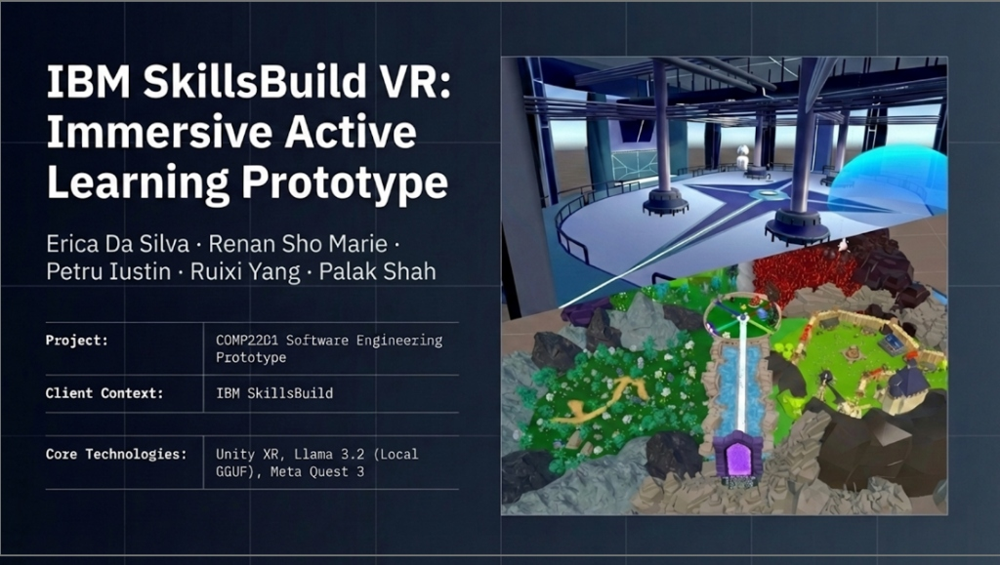
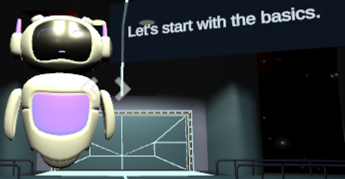

<h1>IBM SkillsBuild VR</h1>

  <b>Immersive Active Learning Prototype</b>

  Erica Da Silva &bull; Renan Sho Marie &bull; Petru Iustin &bull; Ruixi Yang &bull; Palak Shah

 
 

 

## 📖 About The Project

This repository hosts a cutting edge virtual reality application designed as a software engineering prototype for COMP2201. It creates an immersive active learning experience tailored for IBM SkillsBuild. By integrating advanced Local Large Language Models, it pushes the boundaries of educational technology.

## ✨ Key Features

* **Intelligent Guidance** A virtual robot assistant powered by local AI helps you navigate the basics organically.
* **Rich Environments** Explore diverse zones from high tech facility interiors to lush outdoor terrains with majestic portals.
* **Active Engagement** Transforming traditional learning from passive absorption into an interactive journey.

## 🛠️ Core Technologies

* **Game Engine** Unity XR
* **Artificial Intelligence** Llama 3.2 Local GGUF
* **Hardware** Meta Quest 3

## 🚀 Getting Started

To experience this project locally, clone the repository and open it within the Unity Editor.

1. Ensure you have the XR Interaction Toolkit and necessary Meta Quest packages installed.
2. Open the main scene.
3. Build and deploy to your headset.

## 🤝 Contributing

This was developed as a university prototype. For any inquiries or contributions, please open an issue or submit a pull request.